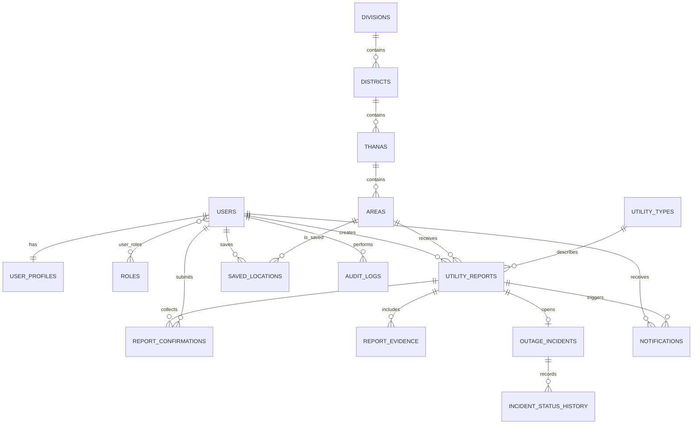

# Ase Naki?

**Ase Naki?** is a student-friendly Spring Boot application where people in Bangladesh can check and report the condition of electricity, gas, water, broadband, and mobile networks.


## What the project demonstrates

- Database registration and login with BCrypt password hashing
- Roles: `USER`, `TRUSTED_REPORTER`, `UTILITY_PROVIDER`, `MODERATOR`, and `ADMIN`
- Spring Validation plus custom validators for unique email, Bangladesh phone numbers, utility-specific statuses, duplicates, and evidence
- A real division ? district ? thana ? area hierarchy
- Confirmations, disputes, restoration voting, saved locations, alerts, moderation, and audit logs
- JPG, PNG, WebP, and PDF evidence upload (maximum 5 MB)
- Evidence stored in the database, so it survives web server restarts
- H2 for a zero-setup classroom demo and PostgreSQL for production
- Responsive Thymeleaf UI, Docker, GitHub Actions, and a Render Blueprint

The code intentionally follows a familiar `Controller ? Service ? Repository ? Entity` flow. Business rules stay in services, input rules stay in form classes and validators, and controllers remain small.

## Run locally

Requirement: Java 21 or newer.

Windows:

```powershell
./mvnw.cmd spring-boot:run
```

macOS or Linux:

```bash
./mvnw spring-boot:run
```

Open `http://localhost:8080`. The local H2 database is saved in `data/asenaki.mv.db`.

### Demo accounts

| Access | Email | Password |
|---|---|---|
| Trusted reporter | `demo@asenaki.bd` | `Demo123!` |
| Local administrator | `admin@asenaki.bd` | `Admin123!` |

The production administrator password is generated by Render through `APP_ADMIN_PASSWORD`. Never place a real production password in this repository.

## PostgreSQL with Docker

```bash
docker compose up --build
```

## Main database relationships



- **One-to-one:** user ? profile; report ? outage incident
- **One-to-many:** area ? reports; report ? confirmations/evidence; incident ? history
- **Many-to-many:** user ? role through `user_roles`; user ? area through `saved_locations`

## Package guide

```text
com.azizul.asenaki
??? admin          audit entities and repository
??? common         base entity and shared exception
??? config         security and starter data
??? favorite       saved-location relationship and service
??? location       Bangladesh location entities and repositories
??? notification   alerts for saved locations
??? report         reporting entities, forms, rules, and validators
??? user           accounts, profiles, roles, and registration
??? web            small MVC controllers
```

HTML is in `src/main/resources/templates`. CSS, JavaScript, and the hero image are in `src/main/resources/static`.

## Business rules

1. A user cannot vote on their own report.
2. The same user cannot send the same area + utility report again for 30 minutes.
3. Utility-specific statuses are checked by validation and the service.
4. Reports expire automatically after 24 hours.
5. Normal confirmations add 5 points; trusted confirmations add 8.
6. Disputes remove 6 points; trusted disputes remove 9.
7. Evidence adds 10, trusted reporters add 5, and age removes 2 per hour.
8. Confidence is always limited to 0?100.
9. Three community restoration votes close an incident.
10. A moderator action always creates an audit record.

The values can be changed in `src/main/resources/application.yml`.

## Important pages

| Page | URL | Access |
|---|---|---|
| Live dashboard | `/` | Public |
| Register / sign in | `/register`, `/login` | Public |
| Report details and evidence | `/reports/view/{id}`, `/evidence/{id}` | Public |
| Create or vote | `/reports/new` | Signed-in users |
| Saved places and alerts | `/saved-locations`, `/notifications` | Signed-in users |
| Moderation and audit log | `/admin/reports`, `/admin/audit-logs` | Moderator/admin |
| Health check | `/actuator/health` | Public |

All changing form requests use Spring Security CSRF protection.

## Tests

```bash
./mvnw verify
```

Tests cover startup, confidence boundaries, duplicate blocking, and the rule that reporters cannot vote on their own report.

## Deploy with Render and Neon

The repository includes `Dockerfile` and `render.yaml`.

1. Create a PostgreSQL project in Neon and copy its pooled connection string.
2. In Render, create a **Blueprint** and connect this GitHub repository.
3. Enter the Neon connection string when Render asks for `DATABASE_URL`.
4. Wait for `/actuator/health` to become healthy.
5. Register a normal account from the live site.

The Blueprint connects `SPRING_PROFILES_ACTIVE=prod`, a secret `DATABASE_URL`, and a generated `APP_ADMIN_PASSWORD`. Uploaded evidence lives in Neon PostgreSQL, so deployment does not remove it when the Render web service restarts.

## Responsible use

This is a community information tool, not an emergency service. Do not upload identity documents, private bills, phone numbers, or recognisable faces as evidence.
